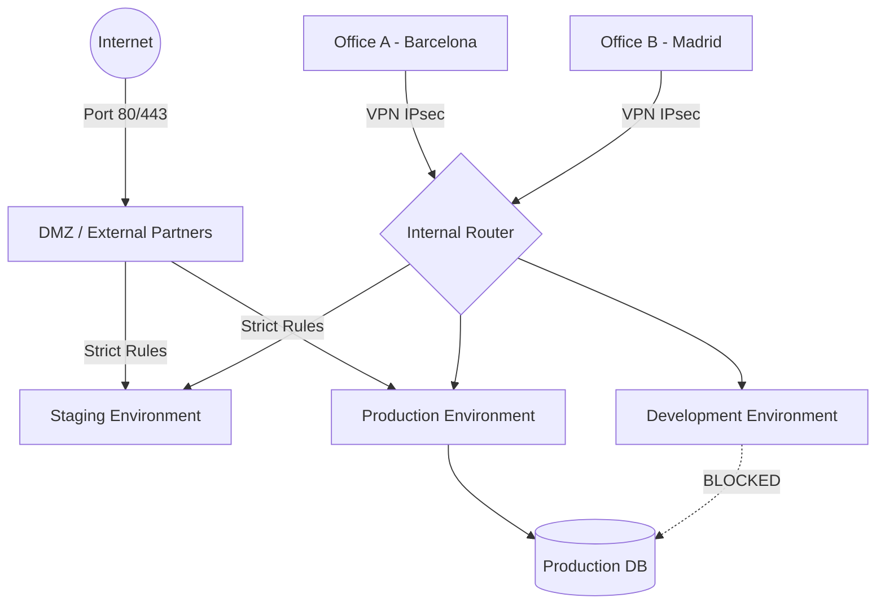

# Week 12 - Network Design & Identity
**Autors:** Pau Cabestany i Eric Hernandez

## 1. Network Architecture Diagram
Hem dissenyat l'arquitectura utilitzant el principi de **"Defense-in-Depth"** (defensa en profunditat)
i segmentacio de xarxes amb minim privilegi a cada capa.



### Representacio ASCII alternativa

```
                              ┌─────────────────────┐
                              │     INTERNET        │
                              └──────────┬──────────┘
                                         │ :80/:443
                              ┌──────────▼──────────┐
                              │   Firewall / WAF    │
                              └──────────┬──────────┘
                                         │
        ┌────────────────────────────────┼────────────────────────────┐
        │                                │                            │
   ┌────▼─────┐                   ┌──────▼──────┐               ┌─────▼─────┐
   │  DMZ     │                   │  Internal   │               │  Mgmt     │
   │ 10.0.10/24                   │  Router     │               │ 10.0.99/24│
   │ partners │                   └──────┬──────┘               │  admins   │
   └──────────┘                          │                      └───────────┘
                          ┌──────────────┼──────────────┐
                          │              │              │
                     ┌────▼─────┐  ┌─────▼────┐  ┌─────▼────┐
                     │   DEV    │  │ STAGING  │  │   PROD   │
                     │10.0.1/24 │  │10.0.2/24 │  │10.0.3/24 │
                     └────┬─────┘  └────┬─────┘  └────┬─────┘
                          │             │             │
                     ┌────▼─────┐  ┌────▼─────┐  ┌────▼─────┐
                     │  DB Dev  │  │ DB Stage │  │  DB Prod │
                     │ 10.0.51  │  │ 10.0.52  │  │ 10.0.53  │
                     └──────────┘  └──────────┘  └──────────┘
```

## 2. CIDR Plan (Pla d'adreçament IP)

Hem reservat el bloc privat `10.0.0.0/16` (65.536 IPs) per a tota l'organitzacio.
Aquest s'ha subdividit en `/24` (254 hosts utils cadascun), donant marge per a creixement.

| Subxarxa        | CIDR           | Hosts utils | Us                                       |
|-----------------|----------------|-------------|------------------------------------------|
| Development     | `10.0.1.0/24`  | 254         | Pods/VMs de devs, lliure per experimentar |
| Staging         | `10.0.2.0/24`  | 254         | Replica de prod per a tests pre-release  |
| Production      | `10.0.3.0/24`  | 254         | Pods d'aplicacio en produccio            |
| Partners (DMZ)  | `10.0.10.0/24` | 254         | Acces extern restringit                   |
| DB segment      | `10.0.50.0/24` | 254         | Bases de dades aïllades (per entorn)     |
| Management      | `10.0.99.0/24` | 254         | Jump hosts, monitoring, admin VPN        |
| Pod CIDR (K8s)  | `10.244.0.0/16`| 65k         | Pods de Kubernetes (gestionat per CNI)   |
| Service CIDR    | `10.96.0.0/12` | 1M          | Services de Kubernetes (cluster IPs)     |

**Per que `/24` i no mes petit?** 254 IPs son mes que suficients per a 20-100 persones, i deixa
marge per a futures expansions sense reconfigurar tot l'addreçament.

## 3. Kubernetes NetworkPolicies (Implementacio)

Els fitxers `01-environments.yaml` i `02-network-policy.yaml` implementen els seguents
controls:

- **Namespace `dev`** i **namespace `prod`** estan separats al cluster.
- **Policy `isolate-production`**: per defecte cap pod externe pot parlar amb pods de `prod`,
  nomes hi accedeixen els pods del mateix namespace.
- **Script `test-seguretat.sh`** demostra que un pod `dev-hacker` NO pot atacar `prod-db`,
  mentre que `prod-worker` SI pot.

### Politica de "default deny" (intermediate)
A mes de la regla d'ingress, recomanem aplicar tambe una regla **default-deny** per a egress
(no pods de prod surten cap a Internet excepte serveis explicits):

```yaml
apiVersion: networking.k8s.io/v1
kind: NetworkPolicy
metadata:
  name: default-deny-egress
  namespace: prod
spec:
  podSelector: {}
  policyTypes:
  - Egress
  egress:
  - to:
    - podSelector:
        matchLabels:
          tier: backend
    ports:
    - port: 8080
  - to:
    - namespaceSelector:
        matchLabels:
          kubernetes.io/metadata.name: kube-system
    ports:
    - port: 53     # DNS
      protocol: UDP
```

## 4. Documentation: Que es permet i que es bloqueja

| Origen          | Desti           | Permet? | Motiu                                   |
|-----------------|-----------------|---------|-----------------------------------------|
| Internet        | DMZ (nginx)     | SI      | Es el punt d'entrada public             |
| Internet        | Backend prod    | NO      | Mai accés directe a logica de negoci    |
| DMZ             | Backend prod    | SI      | Reverse proxy → backend                 |
| Dev             | Prod DB         | **NO**  | Aïllament total entre entorns           |
| Prod backend    | Prod DB         | SI      | Connexió legitima                       |
| Staging         | Prod            | NO      | Staging NO toca produccio               |
| Office VPN      | Mgmt subnet     | SI      | Admins accedeixen via VPN               |
| Partners (DMZ)  | Internal subnets| NO      | Partners nomes veuen serveis publics    |

## 5. Core Services Research

### 5.1 DNS (Domain Name System)

DNS es el "directori telefonic" d'Internet. Quan escrius `google.com` al navegador, el teu
ordinador no sap on es trobat aquest servidor; nomes coneix IPs com `142.250.184.110`. DNS
fa de traductor entre noms llegibles per humans i adreces IP que els ordinadors entenen.

A nivell organitzatiu, GreenDevCorp necessita DNS per dos motius: **(1) DNS public** que
permet als clients trobar `greendevcorp.com`, i **(2) DNS intern** que dona noms a serveis
interns com `db.prod.greendev.local`. Sense DNS, els developers haurien de memoritzar IPs
de tots els microserveis, i un canvi d'IP requeriria reconfigurar codi a tot arreu. A dins
de Kubernetes, el component **CoreDNS** dona aquest servei automaticament: per aixo Nginx
pot trucar `http://backend:8080` sense saber la IP real del pod backend.

### 5.2 DHCP (Dynamic Host Configuration Protocol)

DHCP es el servei que reparteix adreces IP automaticament als dispositius que es connecten
a una xarxa. Quan algu encen el portatil a l'oficina, el seu equip envia un broadcast
"hola, soc nou aqui" i el servidor DHCP li respon amb una IP lliure, la mascara de xarxa,
el gateway i els servidors DNS que ha d'utilitzar.

GreenDevCorp usa DHCP per simplificar l'administracio: amb 50+ portatils, telefons, impressores
i dispositius IoT, configurar IPs manualment seria un malson. DHCP tambe permet polítiques de
seguretat (per exemple, donar IPs d'una subxarxa restringida als dispositius desconeguts).
Per servidors i serveis critics, en canvi, **fixem IPs estatiques** (o reservations al DHCP)
perqué els DNS i firewalls puguin apuntar sempre al mateix lloc.

### 5.3 NTP (Network Time Protocol)

NTP sincronitza els rellotges de tots els ordinadors d'una xarxa amb fonts de temps molt
precises (rellotges atomics, GPS). Pot sonar trivial, pero el temps sincronitzat es **crític**
per a tres coses: **(1) logs i forensics** (si dos servidors mostren temps diferents, es
impossible reconstruir l'ordre dels esdeveniments durant un incident), **(2) certificats TLS**
(un rellotge desviat fa que els certificats es vegin com expirats o no valids encara), i
**(3) autenticacio Kerberos/SSO** (els tickets caduquen exactament en X segons, si els rellotges
desvien mes de 5 minuts, l'autenticacio falla).

GreenDevCorp ha de garantir que tots els nodes de Kubernetes, les VMs i els routers parlin
amb un servidor NTP intern (`ntp.greendev.local`) que al seu torn sincronitza amb pools publics
com `pool.ntp.org`. A Linux, `chronyd` o `systemd-timesyncd` ho fan automaticament.

## 6. Identity Management Research

### 6.1 Autenticacio vs Autoritzacio

**Autenticacio (authN)** respon "qui ets?". L'usuari demostra la seva identitat amb credencials
(contrasenya, token, biometria, certificat). Si el sistema accepta la prova, sap que ets qui
dius ser. Exemple: introduir email + password a Google.

**Autoritzacio (authZ)** respon "que pots fer?". Un cop el sistema sap qui ets, comprova si
tens permisos per realitzar l'accio sol·licitada. Exemple: estas autenticat com a usuari, pero
NO tens permis per esborrar la base de dades de produccio. Una analogia: l'autenticacio es la
foto del DNI a l'entrada de l'edifici, l'autoritzacio es la targeta que t'obre nomes algunes
portes.

### 6.2 LDAP (Lightweight Directory Access Protocol)

LDAP es un protocol estandard per consultar i modificar serveis de directori (com una base de
dades jerarquica d'usuaris, grups, equips, impressores...). Permet a aplicacions diverses (correu,
VPN, K8s, GitHub Enterprise) preguntar "aquest usuari/password es valid?" a una unica font.
Implementacions: **OpenLDAP** (gratuit, opensource), **389 Directory Server** (Red Hat).

### 6.3 Active Directory (AD)

Active Directory es la implementacio de Microsoft d'un directori basat en LDAP + Kerberos +
DNS. Es l'estandard de facto a entorns Windows corporatius. A mes de LDAP, afegeix policies
de grup (GPO), SSO via Kerberos, i gestio centralitzada de maquines Windows. Pot integrar-se
amb Linux/Mac via `sssd` o `samba`.

### 6.4 SSO (Single Sign-On)

SSO permet als usuaris autenticar-se una sola vegada i accedir despres a multiples aplicacions
sense tornar a introduir credencials. Protocols moderns: **SAML 2.0** (empresarial), **OAuth 2.0
+ OIDC** (web/mobile modern). Beneficis: menys passwords a recordar (menys post-its!),
revocacio centralitzada quan un empleat marxa, i auditoria unica de qui accedeix a qué.

### 6.5 Que resol la identitat centralitzada?

Sense centralitzacio, cada eina te els seus propis usuaris i contrasenyes. Quan algu deixa
l'empresa, cal anar app per app desactivant-lo (i sovint algun compte queda viu durant mesos,
un risc enorme). Centralitzar permet:

- **On-boarding rapid**: crear l'usuari una sola vegada al directori i tot funciona.
- **Off-boarding segur**: desactivar al directori revoca acces a tot.
- **Auditoria unica**: una sola font per veure qui ha entrat on.
- **Politiques uniformes**: contrasenyes fortes, MFA, rotacio aplicades a tot arreu.

**Quan ho necessita una empresa petita?** Quan supera ~10 persones i te 3+ eines internes.
**Quan ho necessita una empresa gran?** Sempre - es imprescindible per compliance (ISO 27001,
SOC 2, GDPR).

## 7. Identity Strategy per a GreenDevCorp (20+ persones)

**Recomanacio: comencar amb Google Workspace + SSO (OIDC/SAML) cap a totes les eines internes.**

### Per que?
1. **Tooling minim**: Google Workspace ja es necessari per email i fitxers, i ofereix
   SSO de fabrica.
2. **MFA gratuit**: Google obliga MFA, una capa de seguretat enorme amb cost zero.
3. **Integracions**: GitHub, AWS, Slack, Kubernetes (via OIDC), Grafana... tots suporten
   Google com a Identity Provider.
4. **Cost**: ~6€/usuari/mes ja inclou tot. Per a 20 persones, ~120€/mes.

### Trade-offs
- **A favor**: zero administracio de servidors, alta disponibilitat de Google.
- **En contra**: depenes d'un proveidor extern. Si Google cau, no entres a res.
- **Mitigacio**: cal un compte "break-glass" local per a recovery (admin amb password fisic
  guardat al safe).

### Alternativa avançada (>50 persones)
Quan creixi a 50+ persones, migrar a **Microsoft Entra ID (Azure AD)** o **Okta** te mes
sentit perqué ofereixen Conditional Access, Privileged Identity Management i integracio
amb Active Directory on-premises si calgues.

### Alternativa OpenSource
Per a self-hosting, **Keycloak** o **Authentik** (compatibles amb OIDC/SAML/LDAP) son
excel·lents. Aixo es el que muntariem si Privacy/GDPR exigis no enviar dades a Google.

## 8. Security Analysis: que pot anar malament?

| Risc                                | Mitigacio                                    |
|-------------------------------------|----------------------------------------------|
| Compromis de credencials user       | MFA obligatori + revisio inicis de sessio    |
| Pod-to-pod lateral movement         | NetworkPolicies + securityContext            |
| Imatge Docker amb vulnerabilitats   | Trivy scan al CI/CD (ja implementat)         |
| Secrets al codi                     | `.gitignore` de `.env` + Vault/Sealed Secrets|
| Configuracio drift entre entorns    | IaC (Terraform) com a font de veritat        |
| Caiguda de DNS                      | DNS redundant (CoreDNS + provider extern)    |
| Atac DoS al frontend                | Rate limiting a nginx + WAF                  |
| Vis-a-vis interns (insider threat)  | RBAC granular + auditoria                    |
| Loss of NTP -> autenticacio falla   | NTP redundant (multiple pools)               |
| Backup compromes                    | Backups xifrats off-site + air-gap           |

## 9. VPN entre oficines (Intermediate **)

Per connectar Office A (Barcelona) i Office B (Madrid):
- **Tipus**: VPN site-to-site IPsec (no client-to-site).
- **Tunnel**: IKEv2 amb AES-256-GCM i SHA-384.
- **Subnets**: `10.0.20.0/24` (Office A LAN), `10.0.21.0/24` (Office B LAN).
- **Failover**: dos tunels redundants per via routers diferents.
- **Clients remots** (treball des de casa): WireGuard VPN cap a `vpn.greendev.local`,
  certificats per usuari, MFA obligatori.

## 10. Comprovacio practica
```bash
# Aplicar tots els manifests d'aquest directori:
kubectl apply -f week12/

# Executar el test que comprova la segregacio:
./week12/test-seguretat.sh

# Resultat esperat:
#  Prova 1 (dev-hacker -> prod-db): timeout (BLOQUEJAT ✅)
#  Prova 2 (prod-worker -> prod-db): resposta 200 OK ✅
```
